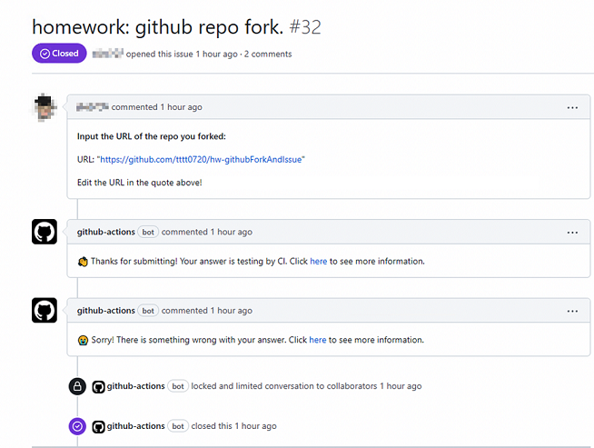

# action-judger
Github action: judge your Issue or PR interactively.

## Action inputs

| Name | Description | Default |
| --- | :-- | --- |
| script | Your script                       |  |
| welcomeText           | Welcome the user                  | `"👋 Thanks for submitting! Your answer is testing by CI. Click [here](${JOB_URL}) to see more information."` |
| waText | Sorry for the user                | `"😭 Sorry! There is something wrong with your answer. Click [here](${JOB_URL}) to see more information."` |
| acText        | Congratulate for the user         | `"🎉 Congratulations! Your answer passed the CI testing!"` |
| addLabelAfterJudging | Add is:answer label after judging | `"true"` |
| setClosedAfterJudging | Close the issue after judging | `"true"` |
| setLockedAfterJudging | Lock the issue after judging | `"true"` |

## Usage

* yml examples：
    * https://github.com/SDUOJ-Team/hw-githubForkAndIssue/blob/main/.github/workflows/checker.yml#L32-L36
    * https://github.com/SDUOJ-Team/hw-gitMergeAndRebase/blob/main/.github/workflows/checker.yml#L32-L39
* Issue examples:
    * https://github.com/SDUOJ-Team/hw-githubForkAndIssue/issues/32
    * https://github.com/SDUOJ-Team/hw-githubForkAndIssue/issues/33

## Contribution

* Welcome to contribute your code by PR.
